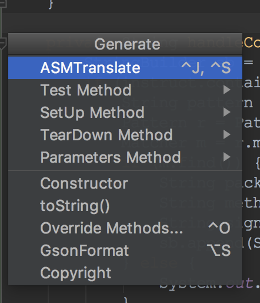
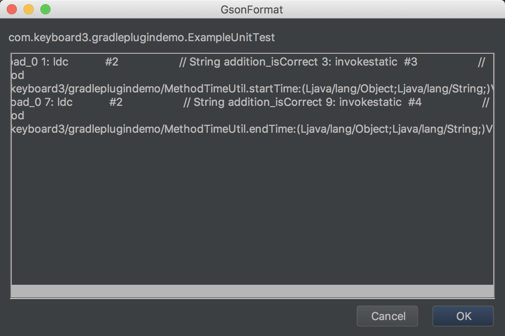
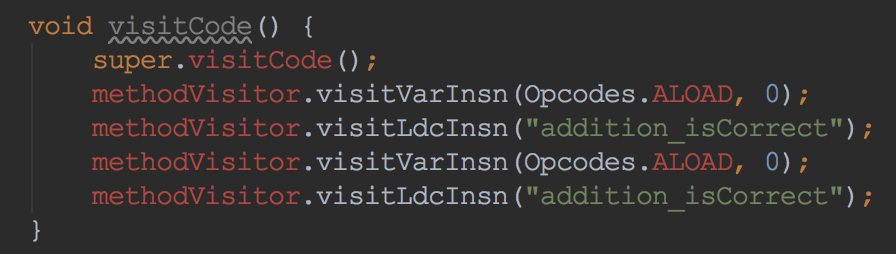
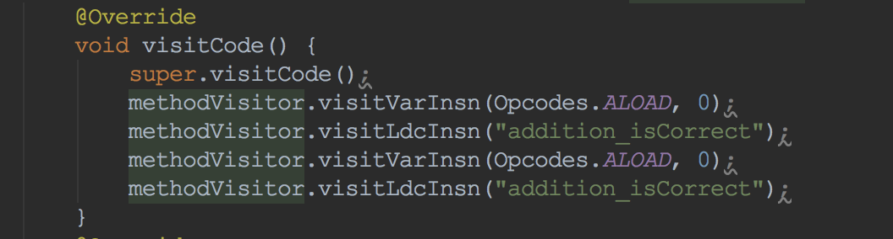

# JavaByteCode2ASMCode
将Java字节码翻译成ASM代码

# 步骤
**下载JavaByteCode2ASMCode.jar，将插件从磁盘安装**

**在Intelli IDEA | Android studio 下的 Code-> Generate 打开插件**
 

**通过 javac 命令拿到 java 字节码放进输入框中**
 

**生成的代码会在当前类文件的末尾**
 

**如果是在 gradle 文件中需要这块代码，先粘贴到文本编辑器中再放到应该的位置**
这样包名不会被自动应用
 

# 支持部 java 指令翻译
invoke、aload、ldc 
 
后续会不断完善